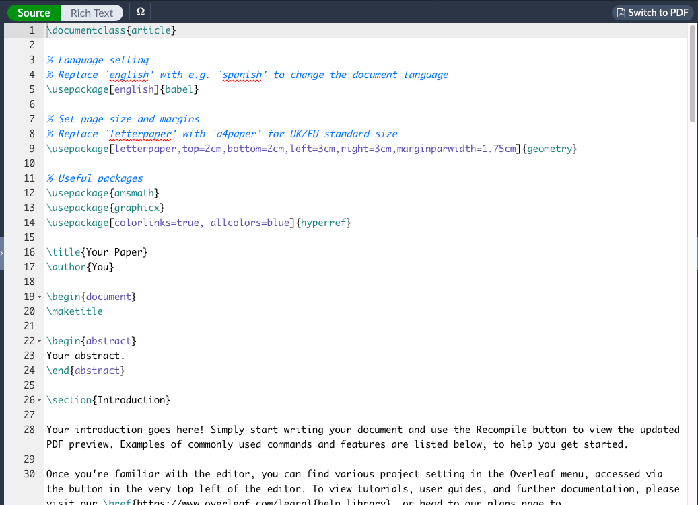

# Documentation with Markdown and <span class="latex">L<sup>A</sup>T<sub>E</sub>X</span> {#ch3}

In this chapter: 

- What is Markdown? Where do I use it? 

- What is <span>L<sup>A</sup>T<sub>E</sub>X</span> and why use it? 

- Let's make this simple: Using Overleaf to create <span class="latex">T<sub>E</sub>X</span>-style documents 

- Conventions in <span class="latex">L<sup>A</sup>T<sub>E</sub>X</span> 

Portions of this chapter were derived from Kieran Healy's [The Plain Person’s Guide to Plain Text Social Science](https://plain-text.co/index.html#introduction) and [Learn LaTeX in 30 minutes](https://www.overleaf.com/learn/latex/Learn_LaTeX_in_30_minutes#Writing_your_first_piece_of_LaTeX)--please check out both of these great resources! 

## Markdown: A Multi-Use Tool 

You will probably encounter Markdown style documentation across a lot of different places nowadays. Markdown is a plaintext approach to markup that helps you easily and efficiently create documentation. Just like the <span class="latex">L<sup>A</sup>T<sub>E</sub>X</span> style that we cover next, Markdown is *not* what we call a "What You See Is What You Get" interface, like we would say Microsoft Word or Pages are. In WYSIWYG environments, when you bold a text or add a header, those changes are automatically reflected in the visualization of the document. Plain text editors do not include these frills as you go, instead you can use certain code elements to implement desired formatting such that details such as bold text and headers are apparent once the document has been rendered or compiled. 

:::: {style="display: flex;"}

::: {}
This is all a lot of gibberish to begin with, so let's just cut to Markdown now. Among these simple text editors, Markdown is likely the *most* simple of the variety. Markdown files can be easily created in various different programs and thus ported to be read among just as many. You will most likely use Markdown in version control applications and now in RStudio!

Here we will start with some minimal exploration in Markdown in RStudio and a sort of default into a html document. This won't be *immediately* relevant to everything you do, however Markdown documentation *will* be relevant to version control in Github, as well as for creating presentations down the line. So, we'll take a slow dive in.

To get started, open up RStudio and in the left-hand corner you will click to open a new file. In the dropdown menu you will see the option **R Markdown...**, choose that option and in the next dialogue box leave the options as is and click **OK**. 

:::
::: {}

:::
::: {}

{width=1.5in}
:::

:::: 

The file that you have created will have the necessary preamble information to be able to later compile the document plus the basic rundown of the structure of an R Markdown file. It will look something like this: 

{width=90%}

The necessary preamble information is the YAML section. This area will configure certain specifications for the document that you hope to achieve. Here, R has already specified the title, author, date, and output format for us. However, we are able to edit that at will. Go ahead, and change the **title** to something fitting for a tutorial in Markdown. As a note, this is the title that will appear at the top of the final document, not the file name. 

You are free to scroll through this base level document to see what a "typical" Markdown text might look like. For the most part, you can type in Markdown exactly what you want to type and it will render as such. The catch is knowing how to achieve certain details to emphasize your text, create sections, insert example code bits, and so on. At this point, I would typically just delete all this base tutorial text from the file to replace it with my own. However, we will leave it there now as some of file includes some illustrative examples of the Markdown language.  

As you'll notice in the basic document, there are certain standalone text bits set aside with `#` or `##`. In Markdown language the hashtag is how you designate headers of different levels. Each additional hashtag designates a lower level heading. That is: 

- `#` First level heading 

- `##` Second level heading 

- `###` Third level heading

Inputting these hashtags into the plain text Markdown thus will not automatically create these headings with bold text and slightly larger font in the plain text itself. Instead, this means that we have specified that once we render the document, we should expect that these parts of the text are configured as section headings of varying intensity. 

There are also some easy ways to add emphasis to our text in Markdown:

- `*text*` or `_text_` *Italics* 

- `**text` or `__text__` __Bold__

- `_**Emphasis**_` _**Emphasis**_


- `[text or title](url)` Hyperlink

- `---` Horizontal sectioning 

- Unnumbered lists can be included (like this one) by starting lines with `-`

- Numbered lists can be included by starting lines with ascending numerical order, such that: 
  1. Lists
  2. Look
  3. Like 
  4. This


This [handy Markdown cheat sheet](https://www.markdownguide.org/cheat-sheet/) includes all of these possibilities and more. 

Other things included in this minimal example are code chunks and ways to embed plots. Those pieces are a little far off from where you are now, but this example at least exposes you to what the possibilities of a Markdown document in R might allow. Other option included quick format tables, emojis `r emo::ji("smile")`, hyperreferences to other spots in the documentation, and the list goes on. 

Let's now see what we can render from the document as is. In the toolbar of the R Markdown file, you will see a button to **Knit** the document. Choose this and let the console run its magic. Once the document has been rendered it will pop up in R's Editor window. If your html document has compiled, then we are at the end of the road for now. Otherwise, we have something (likely minor) to debug. 

But *what is Markdown good for*? Well a lot. In R alone, you can author documents to pdf, html, and more for papers, presentations, websites, etc. In other places, such as on Github version control, you use Markdown to comment on code, data, and other parts of a project in motion. You can also use Markdown language on Github and other sites to easily integrate into other html workflows to write websites from scratch without really having to expand your existing coding knowledge. There are even note-taking platforms where Markdown language is used, which takes a lot of the tedious work of note-taking out of the equation. Knowing Markdown is really portable and adaptable to a lot of different situations and spaces, and figuring out how to integrate it into your workflow now will save some headache down the road. So much so, that I recommend that you take a look at this guide to [plain text work flows](https://plain-text.co/index.html#introduction) by Kieran Healy, a professor of Sociology. 

## <span class="latex">L<sup>A</sup>T<sub>E</sub>X</span>: It's pronounced LAH-tekh or LAY-tekh

<span class="latex">L<sup>A</sup>T<sub>E</sub>X</span> is a document preparation program that allows you to easily develop documents in plain text that are later compiled into PDF form. <span class="latex">L<sup>A</sup>T<sub>E</sub>X</span>, like Markdown is not a WYSIWYG platform. Instead, <span class="latex">L<sup>A</sup>T<sub>E</sub>X</span> uses an underlying computational software to turn the typed plain text into a user-specified style output that can easily be changed to conform to your desired specifications, or those of academic journals. With <span class="latex">L<sup>A</sup>T<sub>E</sub>X</span>, formatting tables, writing equations, and formatting section and figure labels becomes a breeze. What this all means will become more clear as we explore further. 

There are many distributions that will help you navigate the creation of <span class="latex">L<sup>A</sup>T<sub>E</sub>X</span> documents, including even some features in R. However, online programs are becoming more useful and transportable means to navigate the <span class="latex">L<sup>A</sup>T<sub>E</sub>X</span> environment.

So, instead of asking you to download any software, we'll instead direct you to go to [Overleaf](https://www.overleaf.com/), an online TeX editor that is also a collaborative environment. Overleaf makes it easy to see document history, discover templates for specific document types (e.g. CVs or posters) or journal submission requirements, and access your projects from many different machines without having to download <span class="latex">L<sup>A</sup>T<sub>E</sub>X</span> on each of them. 

Throughout this course, and likely others, you will use <span class="latex">L<sup>A</sup>T<sub>E</sub>X</span> to format and compile your homework assignments. In many cases, your homework problems are already typeset into a <span class="latex">L<sup>A</sup>T<sub>E</sub>X</span> document, all that you will be required to do is format the answers in the same document and compile the document (i.e. convert the document into a PDF) to turn in via email or on Canvas. 

In the case that you would instead like to explore a software option for <span class="latex">L<sup>A</sup>T<sub>E</sub>X</span> on your home computer, you can check out [TinyTeX](https://yihui.org/tinytex/). 

### Getting Set Up on Overleaf 

To get started, you will need to create an [Overleaf account](https://www.overleaf.com/register). This is straightforward. A premium plan is likely not necessary right now, though you might consider looking into the more advanced plans later. The premium student plan is available for only $8/month. 

Once you have created your account and logged in, you will encounter your main page. One day it will be filled with all of your works in progress, but for today it should look something like this: 

{width=90%}


As you can see, this site is pretty easy to navigate and we'll leave it up to you to explore a little bit. 


## Your First <span class="latex">L<sup>A</sup>T<sub>E</sub>X</span> Overleaf Project 

To get started, choose the **New Project** button in green on the left-hand side of the page. In the drop-down menu, choose "Example Project" and name the project something like "2022_Tutorial_LASTNAME". 

Once you select **Create**, the new project will open. On this project page, the far left-hand side is a file tree of all the images, .tex files, or other necessary components needed to compile the final document (this will make sense, we promise!!). 

The middle pane is your plain text file. At start-up, this file will be named "main.tex"-- all plain text files that you want to render in a pdf end in ".tex". The "main.tex" file is where you will want to input all of the text that you wish to publish for this particular document. 

{width=100%}


The right-hand pane is a preview of your rendered document given the formatting specifications given in "main.tex".  

{width=100%}


This example document provided by Overleaf will go a long way in showing you the intricacies of preparing a TeX-style document. Here, we'll go over some of the main points to ensure you can at least turn in the first few homework assignments without an issue. 

## The Anatomy of a TeX-style document 

This section will assume that you are still viewing the same tutorial document accessed in the previous section. Here we will discuss a bit about the composite elements of a TeX document required to successfully compile. A compiled TeX file is one that made the journey from plain file to PDF rendered document.

The beginning of every .tex file will start with a **preamble**. The preamble is the section where you specify the document class, details you would like to implement throughout the document, and define the parameters of elements that might appear in the text. The preamble is also important for indicating which packages that you would like LaTeX to use to create certain features of your text. Packages are simply additional code components developed to make certain features more feasible without requiring that users code all the specifications themselves. Different packages are useful for modifying the design and layout of things like tables or sections with multiple column. 

In the tutorial .tex document on Overleaf, the following text composes the preamble, which is not published text. After the preamble, the code `\begin{document}` begins the section of published text. 

```{r, eval=F}
\documentclass{article}

% Language setting
% Replace `english' with e.g. `spanish' to change the document language
\usepackage[english]{babel}

% Set page size and margins
% Replace `letterpaper' with `a4paper' for UK/EU standard size
\usepackage[letterpaper,top=2cm,bottom=2cm,left=3cm,right=3cm,marginparwidth=1.75cm]{geometry}

% Useful packages
\usepackage{amsmath}
\usepackage{graphicx}
\usepackage[colorlinks=true, allcolors=blue]{hyperref}

\title{Your Paper}
\author{You}

\begin{document}
```

Two elements of this preamble are absolutely necessary in all cases. The codes `\documentclass{}` and `\begin{document}` are required of all documents. Additionally, `\end{document}` is always required at the end of the text to ensure that the document compiles. The remaining packages are loaded in via the command `\usepackage{}`. We won't cover anything else related to class="latex">L<sup>A</sup>T<sub>E</sub>X</span> packages here, as there are a multitude of them and each has their own documentation 

The text between the commands `\begin{document}` and `\end{document}` is the **body**. The body of the text is exactly as you specify it to be! While this is where you will type all of the relevant text you want to typeset, you will also see the body littered with *commands* and *comments.* Throughout a .tex file a command will always begin with a back slash `\` followed by the chosen command. To ensure that the command runs properly, you will have to ensure that the accompanying package is included in the preamble. For example, if I wanted to typeset a table with a caption I would specify the command `\begin{table}` before the table and formatting text and specify the `\end{table}` at the end, the `\caption{}` command falling somewhere between. 

```{r, eval=F}
\begin{table} 

\caption{Here is a table about interesting activities in Chicago}
\begin{tabularx}{|c|c|}
\hline 
Actvity & Neighborhood \\ 
\hline 
WhirlyBall & Logan Square \\
\hline 
Nature Conservatory & Lincoln Park or Garfield Park \\
\hline 
\end{tabularx}

\end{table}
```

You might also want to comment on your code, or put notes as to what certain packages do as in the preamble above. To do so, you simply begin the comment text with a percentage symbol `%`. The comment can begin anywhere in the text that you want and is stopped when a new line of text is started (i.e. you must hit *Return* to end the comment line). 

### Exercise 

1. Change the preamble text in the tutorial document to reflect your authorship and a chosen title. See the commands for `\title{}` and `\author{}`. 

2. Edit the abstract text to describe a few goals you have for this class or your first year of grad school. 

3. Recompile the document and take a look at the right-hand pane of Overleaf. Does the newly compiled document reflect your changes? Or do you get an error? 

## Adding dimension to a base document 

Given the above section, you should be able to make sense of the basic elements necessary to compile a TeX document into a PDF. Beyond these necessities, there are a lot of ways to play around with the text to make it more readable and interesting, or to input relevant figures to the text. The tutorial document walks you through many of these issues, such as creating sections, adding figures and tables, lists, and equations. You should walk through each of these sections to ensure that you have an even better grasp of <span><class="latex">L<sup>A</sup>T<sub>E</sub>X</span>. For now, skip the section on citations and references (2.9), but you will *definitely* want to come back to this later given Overleaf's integration with Zotero and Mendeley. 

There are a couple of things that the Overleaf Tutorial did leave out about altering text that are worth mentioning here. 

1) Bold or italic text is included via the commands `\textbf{*text here*}` and `\textit{*text here*}`, respectively. Further examples are available regarding text features like that in [this Overleaf documentation](https://www.overleaf.com/learn/latex/Bold%2C_italics_and_underlining). 

2) Moving from typical text processing software to TeX document preparation can be difficult because you can't always coerce the spacing that you want. Skipping lines does not equate to creating spacing in the resulting PDF. Instead we have to coerce spacing via different commands. To coerce vertical space, you can use the command `\vspace{}` with the desired amount of spacing and a unit of measurement. The same can be done to tab spacing, or create horizontal space, via the command `\hspace{}`. You can also coerce a line break with `\\` at the point where you desire the line break. 

3) Related to (2), paragraph indenting is not as simple as tabbing as in Word or another word processor. Instead, you can specify this via a command in the document related to indentation for the entire document `\setlength{\parindent}{}`. The argument for this command should specify the length of the desired indent in the points or `pt`. More [here](https://www.overleaf.com/learn/latex/Paragraphs_and_new_lines#Paragraph_indentation). 

4. In an equation environment, you cannot use regular text without breaking the equation. If you want to use text in an equation environment without closing off the equation first, you can use the command `\text{}` with the desired regular text. 

### Exercise 

1. Start a new section at the end of the tutorial document that you name **Tutorial Workspace**. 

2. In your new Tutorial Workspace, create a numbered list of skills that you would like to learn by the end of Math Camp. List them in the order of your priority. 

3. Using an unnumbered list environment, create a list of supplies that you think might make grad school better. They can be real or imaginary supplies. 

4. Create a paragraph where you describe the things that you have learned in Math Camp so far in **bold** characters. Write a couple sentences about what you are excited about in *italics*. 

