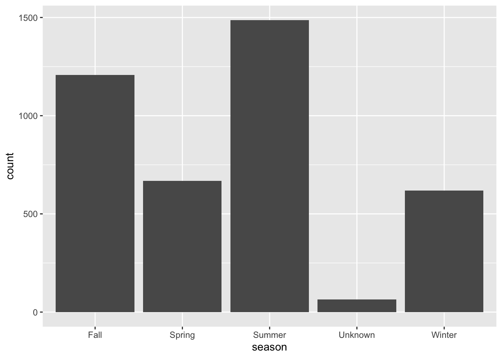
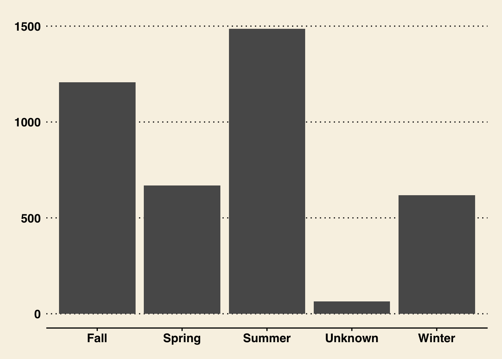
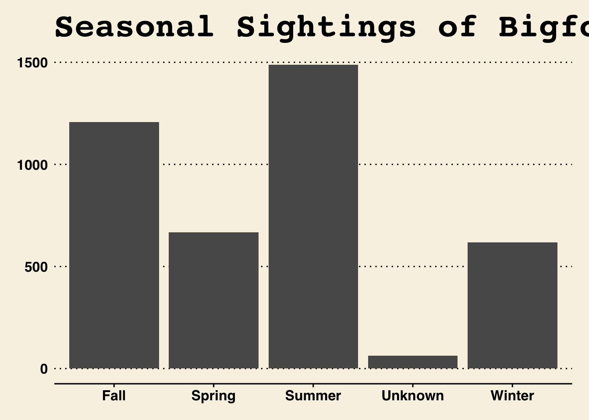
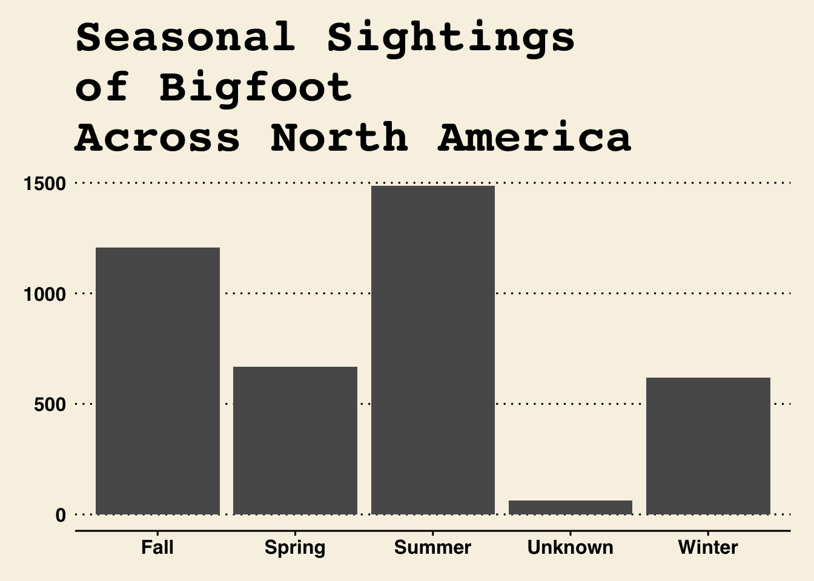
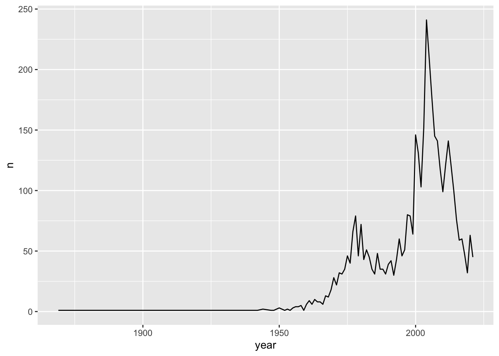
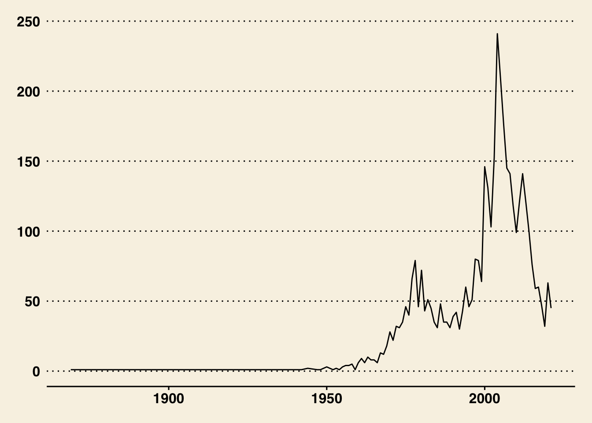
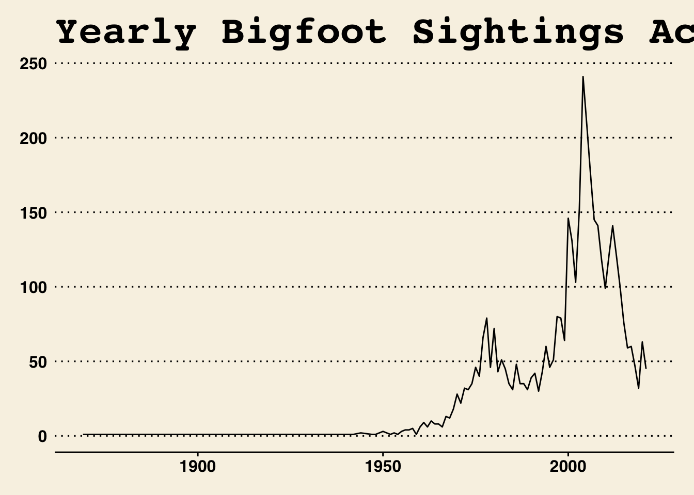
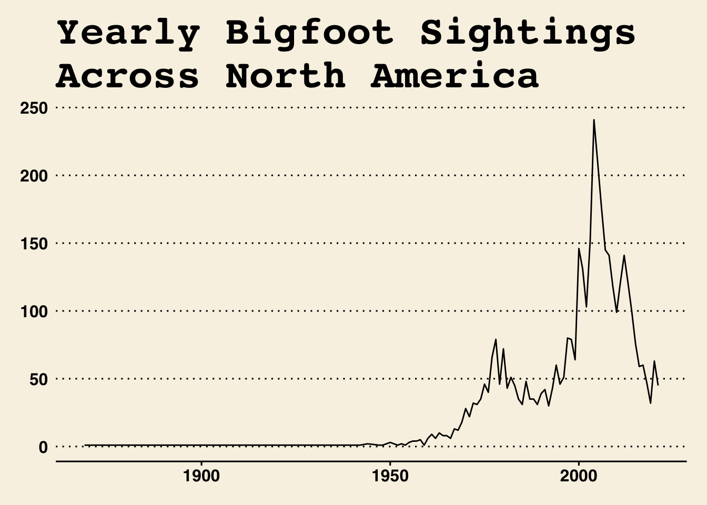

# Data Science Exercise 

## "I have a job for you..." 

It's late Tuesday night, the evening after your first day of graduate school, when you receive an email from a professor that you know, but like you *don't really* know. The subject is vague: "I have a job for you...".

Ok... 

So, you open it and read the following. 

*Welcome to Northwestern! I am in need of an RA to do some data tasks. I figured that you should be learning this stuff about now,  so it might be a good opportunity to put you to work! The pay is $24/hour. Here's what I'd be asking you to do:*

1. Download some [data](https://raw.githubusercontent.com/rfordatascience/tidytuesday/master/data/2022/2022-09-13/bigfoot.csv) from [this tidytuesday post](https://github.com/rfordatascience/tidytuesday/tree/master/data/2022/2022-09-13). 

2. Go through the data and get a feel of what the variables are about. 

3. Sort the data by date. See if you can get a by-year count of observations...

4. Can you also get a count of observations in each state? Do any counties have more than one observation? Which counties have the most over time? 

5. What's the mean number of sightings or observations per year? 

6. I need you to save the following data for me: the mean visibility, moon phase, and windspeed? 

7. You'll see some testimonies included in the "observed" column. What are the 4 most recent testimonies? 

8. This might be a little advanced, but maybe you can make some graphs: 

  - Bar graph of observations per season (none of the base R stuff... my associates only want to see ggplot2 graphics...)
  
  - Line graph of observations per year since the beginning of the dataset
  
... the graphics would be even BETTER if we can have them ready for print. I'm thinking New York Times or  Wall Street Journal style? 
  
*I don't use Github, but I need to make this information accessible **FAST**. If you can push this to your GitHub repository soon, my other associates will take it from there.*

You're even more puzzled than you were to begin with, but you spent too much money on your new snow boots and winter coat in preparation for Chicago winter that you *really* can't turn down the opportunity for some more money. 

What's the worst that can happen? So, you get started... 

## Step One: Get the Data 

So, you know you need to get the data. And you remember Jennifer taught you how to load it directly from GitHub. But I kind of want to have a local copy on my computer? So I can put everything on Github later. 

I'll just deal with this later...let's load in the data. Let's name the dataframe something intuitive that makes sense for now. I'll also make sure to load in the tidyverse because it seems like I'll take a look at it. I can also use `glimpse()` to view the data names and types. 


```r
library(tidyverse)
```

```
## ── Attaching packages ─────────────────────────────────────── tidyverse 1.3.2 ──
## ✔ ggplot2 3.3.6      ✔ purrr   0.3.4 
## ✔ tibble  3.1.8      ✔ dplyr   1.0.10
## ✔ tidyr   1.2.0      ✔ stringr 1.4.1 
## ✔ readr   2.1.2      ✔ forcats 0.5.1 
## ── Conflicts ────────────────────────────────────────── tidyverse_conflicts() ──
## ✖ dplyr::filter() masks stats::filter()
## ✖ dplyr::lag()    masks stats::lag()
```

```r
prof_data<-read.csv("https://raw.githubusercontent.com/rfordatascience/tidytuesday/master/data/2022/2022-09-13/bigfoot.csv")

glimpse(prof_data)
```

```
## Rows: 5,021
## Columns: 28
## $ observed           <chr> "I was canoeing on the Sipsey river in Alabama. It …
## $ location_details   <chr> "", "East side of Prince William Sound", "Great swa…
## $ county             <chr> "Winston County", "Valdez-Chitina-Whittier County",…
## $ state              <chr> "Alabama", "Alaska", "Rhode Island", "Pennsylvania"…
## $ season             <chr> "Summer", "Fall", "Fall", "Summer", "Spring", "Fall…
## $ title              <chr> "", "", "Report 6496: Bicycling student has night e…
## $ latitude           <dbl> NA, NA, 41.45000, NA, NA, 35.30110, 39.38745, 41.29…
## $ longitude          <dbl> NA, NA, -71.50000, NA, NA, -99.17020, -81.67339, -7…
## $ date               <chr> "", "", "1974-09-20", "", "", "1973-09-28", "1971-0…
## $ number             <dbl> 30680, 1261, 6496, 8000, 703, 9765, 4983, 31940, 56…
## $ classification     <chr> "Class B", "Class A", "Class A", "Class B", "Class …
## $ geohash            <chr> "", "", "drm5ucxrc0", "", "", "9y32z667yc", "dpjbj6…
## $ temperature_high   <dbl> NA, NA, 78.17, NA, NA, 71.86, NA, 92.24, NA, NA, 74…
## $ temperature_mid    <dbl> NA, NA, 73.425, NA, NA, 61.425, NA, 80.810, NA, NA,…
## $ temperature_low    <dbl> NA, NA, 68.68, NA, NA, 50.99, NA, 69.38, NA, NA, 53…
## $ dew_point          <dbl> NA, NA, 65.72, NA, NA, 51.03, NA, 67.34, 32.55, NA,…
## $ humidity           <dbl> NA, NA, 0.86, NA, NA, 0.79, NA, 0.68, 0.45, NA, 0.7…
## $ cloud_cover        <dbl> NA, NA, 0.86, NA, NA, 0.11, NA, 0.05, 0.00, NA, 0.6…
## $ moon_phase         <dbl> NA, NA, 0.16, NA, NA, 0.07, NA, 0.76, 0.02, NA, 0.1…
## $ precip_intensity   <dbl> NA, NA, 0.0000, NA, NA, NA, NA, 0.0000, 0.0000, NA,…
## $ precip_probability <dbl> NA, NA, 0.00, NA, NA, NA, NA, 0.00, 0.00, NA, 0.70,…
## $ precip_type        <chr> "", "", "", "", "", "rain", "", "", "", "", "rain",…
## $ pressure           <dbl> NA, NA, 1020.61, NA, NA, 1017.26, NA, 1016.80, 1012…
## $ summary            <chr> "", "", "Foggy until afternoon.", "", "", "Partly c…
## $ uv_index           <int> NA, NA, 4, NA, NA, 7, NA, 8, 8, NA, 6, 10, 6, 7, NA…
## $ visibility         <dbl> NA, NA, 2.750, NA, NA, 10.000, NA, 6.922, 8.880, NA…
## $ wind_bearing       <int> NA, NA, 198, NA, NA, 259, NA, 219, 285, NA, 262, 19…
## $ wind_speed         <dbl> NA, NA, 6.92, NA, NA, 8.41, NA, 1.01, 4.01, NA, 0.4…
```

... So, that told me nothing. I guess I probably should have taken a look at the information about the data first? (**YES, ALWAYS!**). 

## [CHECK OUT THE METADATA](https://github.com/rfordatascience/tidytuesday/tree/master/data/2022/2022-09-13)

This is a dataset... about Bigfoot? Ok, well at least it comes from a reputable-sounding source, Bigfoot Field Researchers Organization. And there's this [article](https://timothyrenner.github.io/datascience/2017/06/30/finding-bigfoot.html)? Great! 

So, I really don't have much more information than this. The data are about Bigfoot sightings around the US and North America. There are variables about the location of the sighting, the report provided, environmental and climate data. Ok, well I guess as long as this is ethical research, it's still research! 
Now that I know what this is, I want to save this data to my computer so I can save the changes I might make to it and don't have to continually download it from the tidytuesday post. 


```r
# i want to rename the data now that I know what it's about... something that makes recall of it easy, like "bigfoot" 

bigfoot<- prof_data

# need to find out what the working directory is set to 

#getwd()

#setwd()
```

## Sort the data by date. See if you can get a by-year count of observations...

Next the professor asked if I would sort the data by date and count how many reports were made by year. 

I think there is some verb in `dplyr` that I can use to do this... maybe `arrange()`? I guess I can do this on the date variable, but how can I get the year out of there? 


```r
# can explore more of the data if we want, but for our purposes glimpse() let us know enough (5021 obs. of 28 var.)

# what does arrange() do? 
?arrange

# let's arrange the data 

bigfoot %>%
  arrange(date) -> bigfoot_sorted

# you notice that there are a lot of blanks in the date column when you do this, what can we do to change these to NAs instead of blank rows? 

sum(bigfoot_sorted$date=="")
```

```
## [1] 976
```

```r
bigfoot_sorted$date[bigfoot_sorted$date==""]<-NA

# once we have changed this value we will need to resort and save the arranged data. 

bigfoot_sorted %>%
  arrange(date) -> bigfoot_sorted

# can alternatively do it in descending order. which makes sens that the prof would want? 

bigfoot_sorted %>%
  arrange(desc(date)) -> bigfoot_desc_sorted

##########################

# let's stick to the ascending date arrangement

# now, we can move on to the issue of the per year count. 

# as it stands, the data is in Y-M-D format. we need to think through how to get the date out of there and then count the observations there. 
library(lubridate)
```

```
## 
## Attaching package: 'lubridate'
```

```
## The following objects are masked from 'package:base':
## 
##     date, intersect, setdiff, union
```

```r
ymd(bigfoot_sorted$date)-> bigfoot_sorted$date

bigfoot_sorted$year <- year(bigfoot_sorted$date)
  
# and then count by year and save it 

bigfoot_sorted %>% 
  group_by(year) %>% 
  count() -> bigfoot_yearly
```
## Now let's continue to summarize some of the data as the professor asked

So, now I have manipulated the data a bit. 

Now, I guess I can do most of the rest of the tasks. First, I will check out the geographical distribution like the professor asked. I want to look at the state level and the county level numbers. When we do the county-level count, let's keep the state name so that we know where they actually are and don't confuse similarly named counties in different states.  


```r
# state-level count we can also arrange it in the pipe 

bigfoot_sorted %>% 
  count(state) %>% 
  arrange(desc(n)) -> bigfoot_state_n

# county-level count with state data 

bigfoot_sorted %>% 
  count(county, state) %>% 
  arrange(desc(n)) -> bigfoot_county_n
```

## Mean sightings per year 

The professor had also asked for the per year sightings and then the mean number. 

We can also just return to the yearly intermediate dataset just to limit the amount of work we have to redo. 

```r
mean(bigfoot_yearly$n, na.rm = T) 
```

```
## [1] 59.77381
```

```r
# out of my own curiosity, I want to see what the max number of sightings per year is and when that was... 

bigfoot_yearly %>% 
  arrange(desc(n))
```

```
## # A tibble: 84 × 2
## # Groups:   year [84]
##     year     n
##    <dbl> <int>
##  1    NA   976
##  2  2004   241
##  3  2005   209
##  4  2006   176
##  5  2003   152
##  6  2000   146
##  7  2007   145
##  8  2008   141
##  9  2012   141
## 10  2001   131
## # … with 74 more rows
```

## Mean atmospheric variables 

The professor also asked for me find the following: the mean visibility, moon phase, and windspeed. I can save this as `mean_atmospheric_var`. 


```r
# i can do this all through the same summarize verb 

bigfoot_sorted %>% 
  summarize(mean_vis = mean(visibility, na.rm = T), 
            mean_moon = mean(moon_phase, na.rm = T), 
            mean_windspeed = mean(wind_speed, na.rm = T)) -> mean_atmospheric_var

# i could also just want to select these variables in case I need to revisit them on their own later. what are some other variables i would need to give the data context? 

#bigfoot_sorted %>%
  #select(visibility, moon_phase, wind_speed #what else??)-> atmospheric_conditions
```

## We've seen the numbers, but what are people *saying*? 

I remember that I saved that object about the descending date order data. The professor asked for the 4 most recent testimonies. 


## Now I'll get to do some graphs :) 

I've heard something about `ggplot2`. I don't know anything about it, so I'm really going to copy and paste what others are doing and add in my own frills and data as I can. I'll just go back to my trusty `bigfoot_sorted`


```r
library(ggplot2)
library(ggthemes)

# start with the base plot, no frills
# i should also make sure that the NAs aren't included 

bigfoot_sorted %>% 
  filter(!is.na(year)) %>%
  ggplot(aes(x=season)) + 
  geom_bar() 
```



```r
# let's add a theme 
  
bigfoot_sorted %>% 
  filter(!is.na(year)) %>%
  ggplot(aes(x=season)) + 
  geom_bar() + 
  theme_wsj()
```



```r
# now some labels 

bigfoot_sorted %>% 
  filter(!is.na(year)) %>%
  ggplot(aes(x=season)) + 
  geom_bar() + 
  labs(x= "Season", y = "Sightings per Season", title = "Seasonal Sightings of Bigfoot Across North America") + 
  theme_wsj()
```



```r
# now change some text to fit
max(bigfoot_yearly$n)
```

```
## [1] 976
```

```r
bigfoot_sorted %>% 
  filter(!is.na(year)) %>%
  ggplot(aes(x=season)) + 
  geom_bar() + 
  theme_wsj()+
  labs(x= "Season", y = "Sightings per Season", title = "Seasonal Sightings\nof Bigfoot\nAcross North America")
```



```r
#ggsave("")
```


Now, I should get to that line graph... 

```r
# start with the base plot, no frills
# i should also make sure that the NAs aren't included 

bigfoot_yearly %>% 
  filter(!is.na(year)) %>%
  ggplot(aes(x=year, y = n)) + 
  geom_line() 
```



```r
# let's add a theme 
  
bigfoot_yearly %>% 
  filter(!is.na(year)) %>%
  ggplot(aes(x=year, y = n)) + 
  geom_line() + 
  theme_wsj()
```



```r
# now some labels 

bigfoot_yearly %>% 
  filter(!is.na(year)) %>%
  ggplot(aes(x=year, y = n)) + 
  geom_line() + 
  theme_wsj() + 
  labs(x= "Year", y = "Sightings per Year", title = "Yearly Bigfoot Sightings Across North America")
```



```r
# now change some text to fit
max(bigfoot_yearly$n)
```

```
## [1] 976
```

```r
bigfoot_yearly %>% 
  filter(!is.na(year)) %>%
  ggplot(aes(x=year, y= n)) + 
  geom_line() + 
  theme_wsj() + 
  labs(x= "Year", y = "Sightings per Year", title = "Yearly Bigfoot Sightings\nAcross North America")
```



```r
#ggsave("")
```


... Now I have to figure out this GitHub thing??? 
